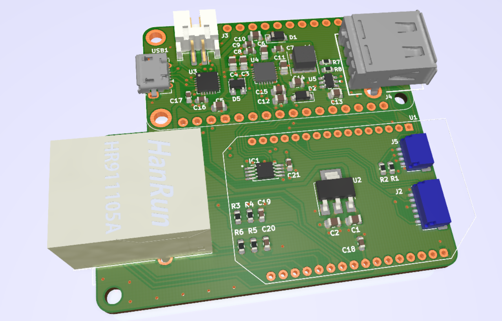
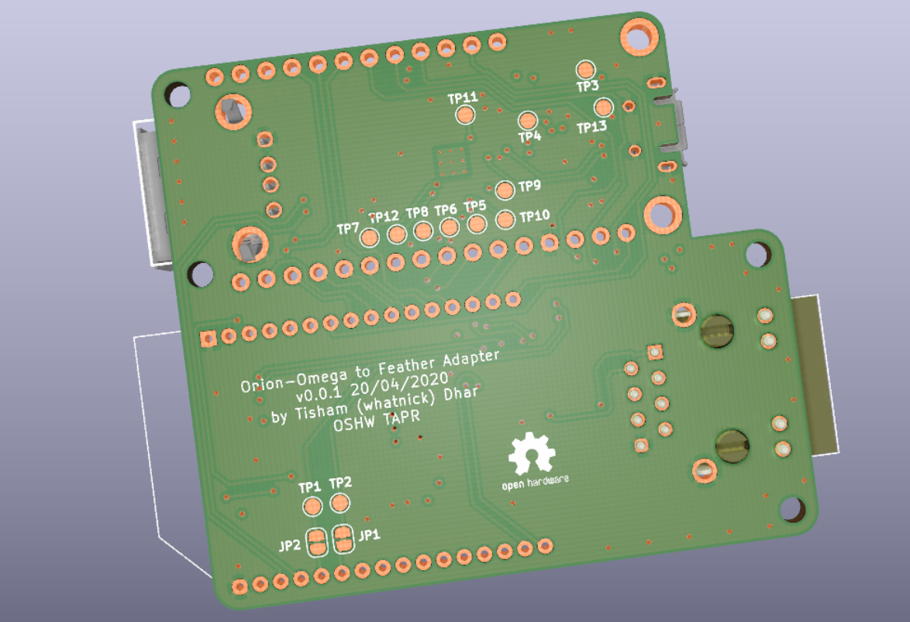

# Onion-Omega 2 - Feather Adapter
Adapter board adding much needed USB , Lipo , ADC's etc to Onion-Omega form factor and converting it to an Adafruit Feather

## Renders

**Top Render**

**Bottom Render**

## Roadmap Features
- USB-Serial adapter on-board for direct access to Onion Serial port - [CP2102](https://au.mouser.com/ProductDetail/Silicon-Labs/CP2102N-A02-GQFN20?qs=sGAEpiMZZMtv%252Bwxsgy%2FhiN7Hc8YFqmm37POrUy82J6M%3D)
- [3.3v](http://www.ti.com/product/TPS63001) and [5v](http://www.ti.com/product/TPS63002) power rails with buck-boost converters and power-path IC's
- USB host to expose the Onion USB pins and add USB devices 
- Ethernet jack with built-in or external pulse transformer - [Amphenol](https://au.mouser.com/ProductDetail/Amphenol-Commercial-Products/RJMG1BD3B8K1ANR?qs=sGAEpiMZZMvQhAhQbXdbBiMgfamRpqKNbIBUiXXy1v4%3D) or [Hanrun](https://www.snapeda.com/parts/HR911105A/DFRobot/view-part/?ref=search&t=HR911105A)
- Battery charger and buck-boost converter - [BQ25895](http://www.ti.com/product/BQ25895)
- 8-channel I2C ADC for the ADC pins - [AD7997](https://www.analog.com/en/products/ad7997.html#product-overview)
- 2-channel I2C ADC for the ADC pins - [MAX11646EUA+](https://au.mouser.com/new/maxim-integrated/maxim-max11646-max11647/) with other Analog pins services by [Onion PCM/PWM](https://docs.onion.io/omega2-docs/generating-pwm-signals.html) pins.
- Dense 20 pin 1.0 mm pitch board-to-wire connector for all pins - [Molex 203566-2007](https://au.mouser.com/ProductDetail/Molex/203566-2007?qs=sGAEpiMZZMs%252BGHln7q6pm8Vn94ktop%2FJB3denez338oFsDPiNVR1nA%3D%3D)
- Qwiic format JST-SH I2C bus connector - [Qwiic](https://www.sparkfun.com/qwiic)
- USB-host protection using [STF202](https://www.onsemi.com/pub/Collateral/STF202-22T1-D.PDF)

## Reference Prior Art
- [Adafruit ESP32 Huzzah Feather](https://github.com/adafruit/Adafruit-HUZZAH32-ESP32-Feather-PCB)
- [BQ25895 Breakout](https://www.bernebeer.nl/new-bq25895-breakout/)
- [Qwiic Featherwing](https://github.com/hongselectronics/Qwiic_Featherwing)